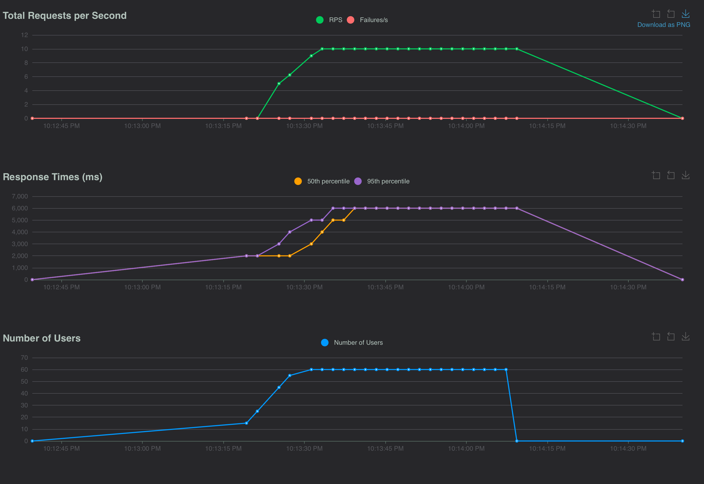

## Limit Concurrent Requests with a Python Semaphore

When a web app calls a rate-limited service, such as the OpenAI API, it helps to cap how many of those calls run at the same time. This article shows a small FastAPI app that uses an `asyncio.Semaphore` to limit concurrent work, and a Locust profile that load tests the app to see the limit in action.

### FastAPI app

The app defines a single `POST /chat` endpoint that takes a `message` query parameter and returns a greeting. The endpoint calls `generate_response()`, which stands in for a slow call to an external service such as an LLM. Instead of making a real API call, it sleeps for two seconds with `asyncio.sleep(2)` to simulate the latency.

The key piece is the module-level `openai_semaphore = asyncio.Semaphore(20)`. Each call to `generate_response()` must acquire the semaphore with `async with openai_semaphore` before doing its work. At most 20 requests can hold the semaphore at once. Any additional requests wait until a slot frees up. The server keeps accepting connections, but the slow work never runs more than 20 times concurrently. Because the semaphore is created once at module level, every request handled by the app shares it.

```python
"""Main app module.

Run this app with uv using the command below.

  uv run fastapi dev src/app.py

Make a request to using the curl command below.

  curl -X POST "http://127.0.0.1:8000/chat?message=world"
"""

import asyncio

from fastapi import FastAPI

openai_semaphore = asyncio.Semaphore(20)

app = FastAPI()


async def generate_response(message: str) -> str:
    async with openai_semaphore:
        await asyncio.sleep(2)
        response = f"Hello {message}"
    return response


@app.post("/chat")
async def chat(message: str):
    text = await generate_response(message)
    return {
        "response": text,
    }
```

### Locust profile

[Locust](https://locust.io) is a Python load testing tool. In the profile below, each simulated user is a `ChatUser`, which is an `HttpUser` with a single `@task` that sends `POST /chat?message=world` to the app. The class doesn't set a `wait_time`, so each user sends its next request as soon as the previous one finishes.

The `set_defaults` function hooks into Locust's command line parser so you don't have to pass the same options every time. It spawns 60 users at 5 users per second, targets the FastAPI app at `http://127.0.0.1:8000`, and serves the Locust web UI on `127.0.0.1`.

```python
"""Locust load test for the /chat endpoint.

Start the app first.

  uv run fastapi dev src/app.py

Then run Locust with the web UI at http://127.0.0.1:8089.

  uv run locust -f src/locustfile.py

This defaults to 60 users spawned at 5 users per second.
It makes requests to http://127.0.0.1:8000 which is the FastAPI app.
"""

from locust import HttpUser, events, task


@events.init_command_line_parser.add_listener
def set_defaults(parser):
    parser.set_defaults(
        num_users=60,
        spawn_rate=5,
        host="http://127.0.0.1:8000",
        web_host="127.0.0.1",
    )


class ChatUser(HttpUser):
    @task
    def chat(self):
        self.client.post("/chat", params={"message": "world"})
```

With 60 users and only 20 semaphore slots, about 40 requests are waiting at any given moment once all users have spawned. Throughput should level off at about 10 requests per second (20 slots ÷ 2 seconds per request). Response times should climb from about 2 seconds (2,000 ms) to about 6 seconds (6,000 ms), because each request waits its turn in the queue before running. That plateau in the Locust charts (see below) shows the semaphore doing its job.


